<div align="center">

# 🚀 Simple Laravel Setup

### Client-Server Week 02 Activity — Laravel Development Environment Setup


<br>


</div>

<br>

## 📋 Table of Contents

- [Introduction](#-introduction)
- [Objectives](#-objectives)
- [Development Environment](#-development-environment)
- [Setup Flow](#-setup-flow)
- [Installation Steps](#-installation-steps)
- [Project Structure](#-project-structure)
- [Problems Encountered](#-problems-encountered)
- [Solutions](#-solutions)
- [Reflection](#-reflection)
- [References](#-references)

<br>

---

## 📖 Introduction

Laravel is a free, open-source PHP web framework built on the **MVC (Model-View-Controller)** architectural pattern. It provides expressive syntax, built-in tools for routing, authentication, database management, and templating (via Blade), which makes it a popular choice for building modern web applications quickly and securely.

Client-server technologies form the foundation of how modern web applications operate — the **client** (browser) sends requests, and the **server** (in this case, powered by Laravel and PHP) processes and returns responses. Understanding how to properly set up a client-server development environment is an essential skill for any IT student, as it forms the basis for building, testing, and deploying full-stack web applications.

> 💡 **Purpose:** To set up the necessary software, tools, and files required to develop with Laravel — including PHP, Composer, the Laravel Installer, Git, MySQL, and Visual Studio Code — and to create a basic Laravel project as a hands-on introduction to the framework.

<br>

---

## 🎯 Objectives

- [x] Install and configure PHP, Composer, Git, MySQL, and Visual Studio Code as part of the Laravel development environment.
- [x] Install the Laravel Installer and verify that it was set up correctly.
- [x] Create a new Laravel project using Composer's `create-project` command.
- [x] Run the Laravel development server using `php artisan serve` and access the default welcome page through a browser.
- [x] Customize the Laravel homepage to display personal student information.
- [x] Push the completed project to a GitHub repository following the required naming convention and folder structure.

<br>

---

## 💻 Development Environment

| Software | Version |
|:---|:---|
| 🖥️ Operating System | Windows 10 (Version 10.0.19045.6216) |
| 🐘 PHP | 8.5.9 (cli) |
| 🔺 Laravel | 13.23.0 (Framework) / Laravel Installer 5.31.0 |
| 📦 Composer | 2.10.2 |
| 🔧 Git | 2.55.0.windows.3 |
| 🐬 MySQL | 8.0.46 for Win64 on x86_64 (MySQL Community Server - GPL) |
| 📝 VS Code | Latest stable release |

<br>

---

## 🧭 Setup Flow

A quick visual overview of how each installation step led into the next:

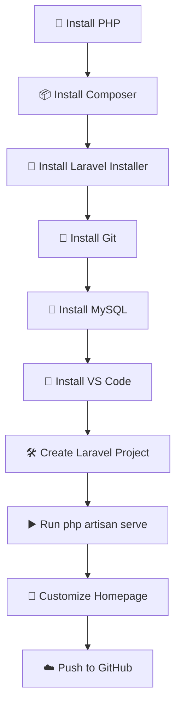

<br>

---

## ⚙️ Installation Steps

### Part 1 — Install PHP
Installed PHP and verified the installation using the command below.
```bash
php -v
```
<p align="center">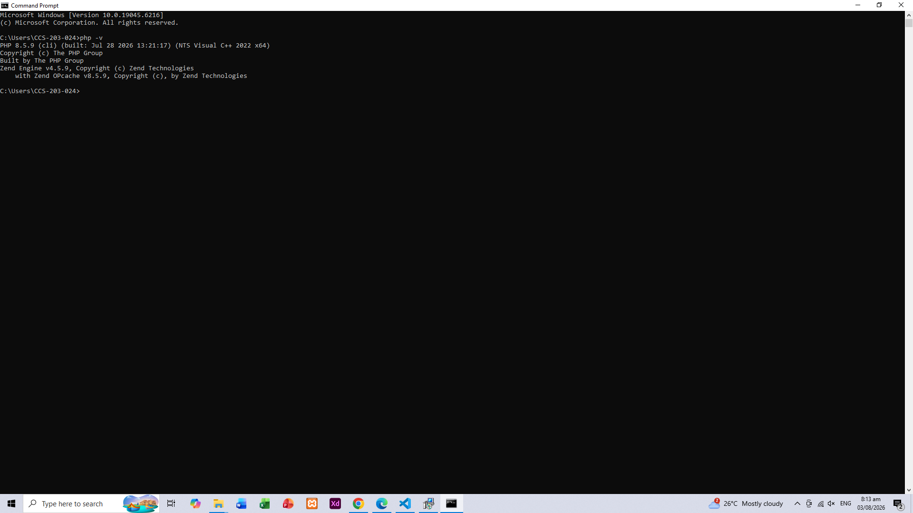</p>

> 📌 *PHP version check — confirms PHP 8.5.9 is installed and recognized in the terminal.*

---

### Part 2 — Install Composer
Installed Composer (PHP's dependency manager) and verified it.
```bash
composer -V
```
<p align="center">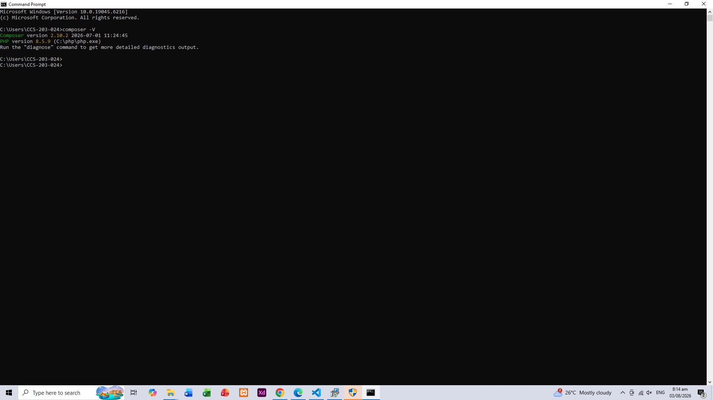</p>

> 📌 *Composer version check — confirms Composer 2.10.2 is installed and linked to PHP 8.5.9.*

---

### Part 3 — Install Laravel
Installed the Laravel Installer globally via Composer and verified it.
```bash
laravel -V
```
<p align="center">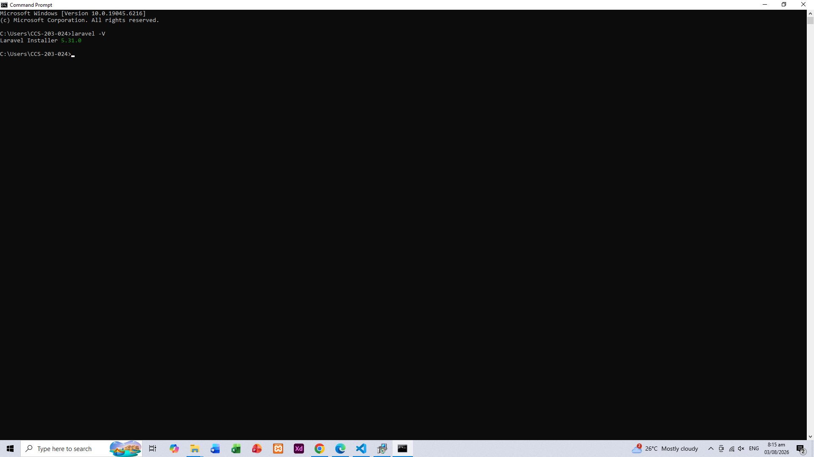</p>

> 📌 *Laravel Installer version check — confirms Laravel Installer 5.31.0 is ready to use.*

---

### Part 4 — Install Git
Installed Git for version control and verified the installation.
```bash
git --version
```
<p align="center">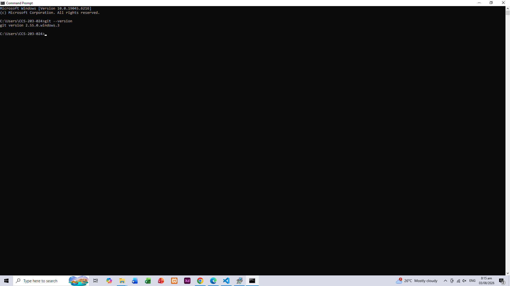</p>

> 📌 *Git version check — confirms Git 2.55.0 is installed.*

---

### Part 5 — Install MySQL
Installed MySQL Community Server for database management and verified it.
```bash
mysql --version
```
<p align="center">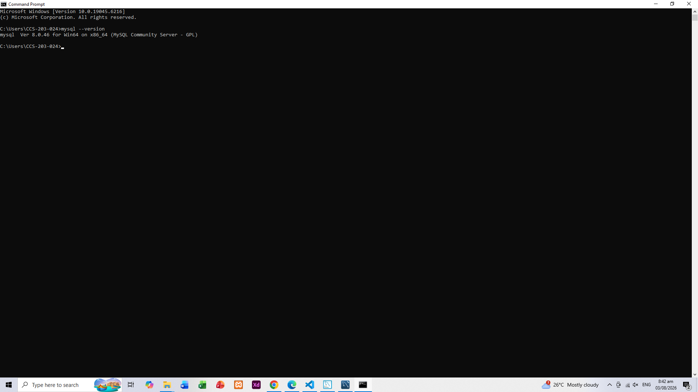</p>

> 📌 *MySQL version check — confirms MySQL Server 8.0.46 is installed.*

---

### Part 6 — Install Visual Studio Code
Installed VS Code and opened the Laravel project folder in the editor.
<p align="center">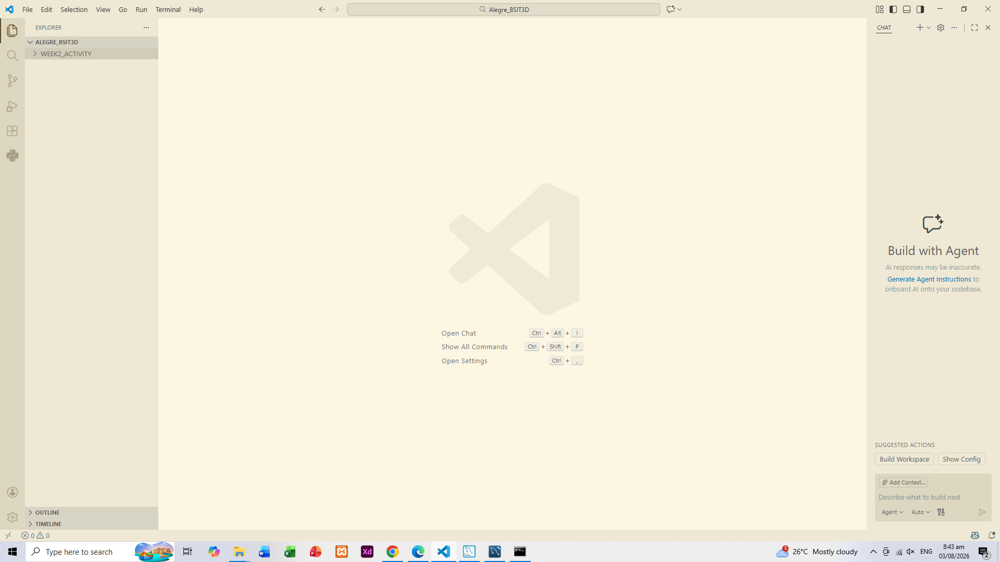</p>

> 📌 *VS Code opened with the project workspace, ready for development.*

---

### Part 7 — Create Laravel Project
Created a new Laravel project using Composer.
```bash
composer create-project laravel/laravel hello-laravel
```
<p align="center">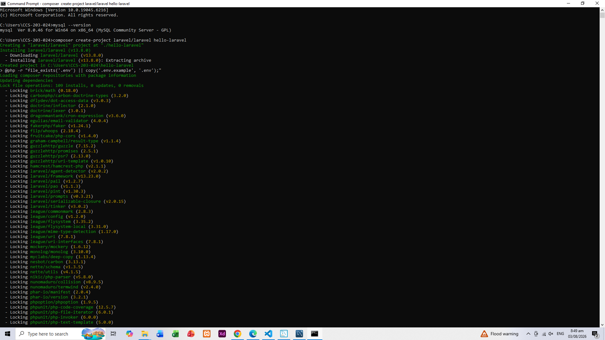</p>

> 📌 *Running `composer create-project` to scaffold the `hello-laravel` project and lock dependencies.*

<p align="center">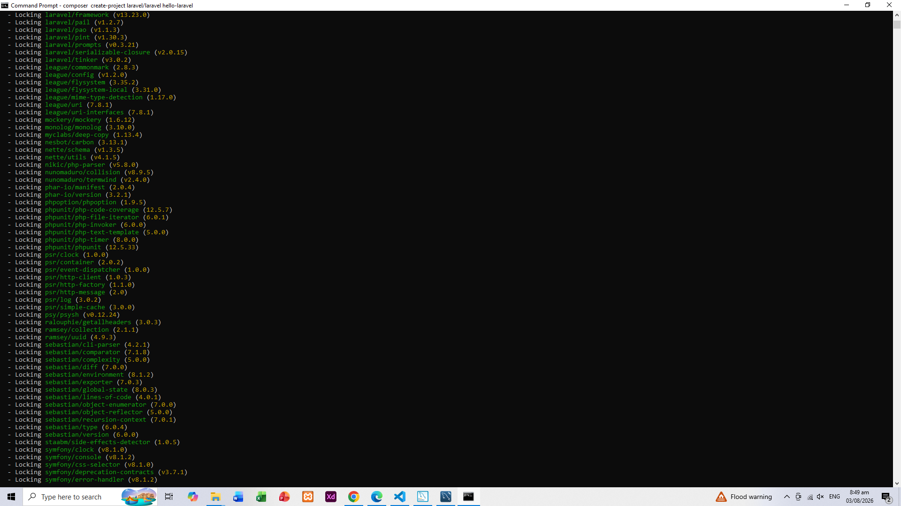</p>

> 📌 *Composer downloading and installing Laravel's required packages.*

<p align="center">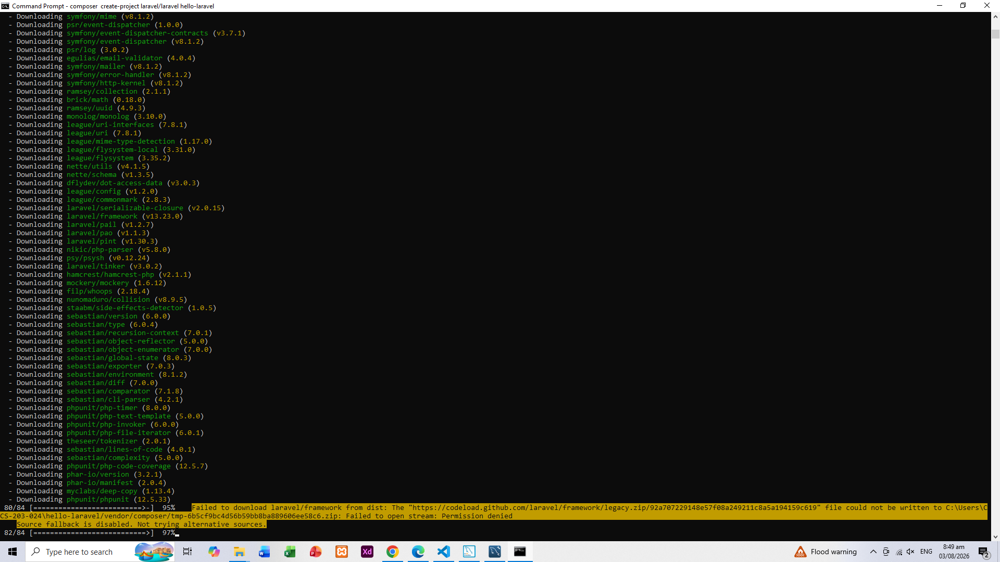</p>

> 📌 *Laravel project successfully created with all dependencies installed.*

---

### Part 8 — Run Laravel
Ran the built-in Laravel development server and confirmed the app loads on the browser.
```bash
php artisan serve
```
<p align="center">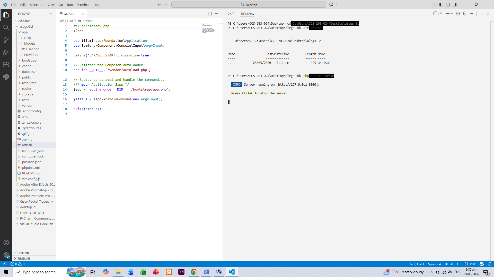</p>

> 📌 *Laravel development server running at http://127.0.0.1:8000.*

<p align="center">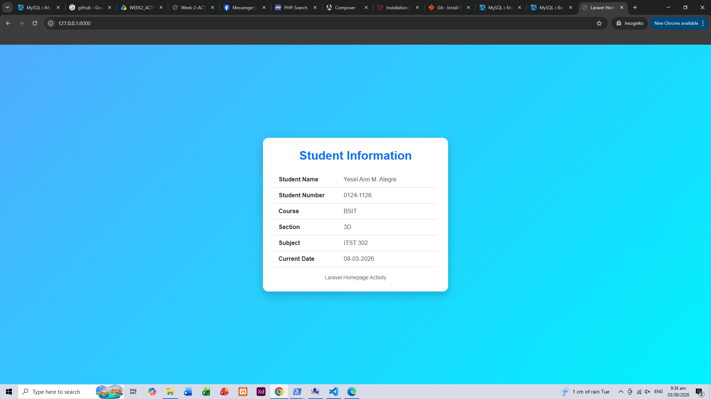</p>

> 📌 *Default Laravel welcome page displayed successfully in the browser.*

---

### Part 9 — Modify the Homepage
Customized the default homepage to display student information: Student Name, Student Number, Course, Section, Subject, and Current Date.
<p align="center">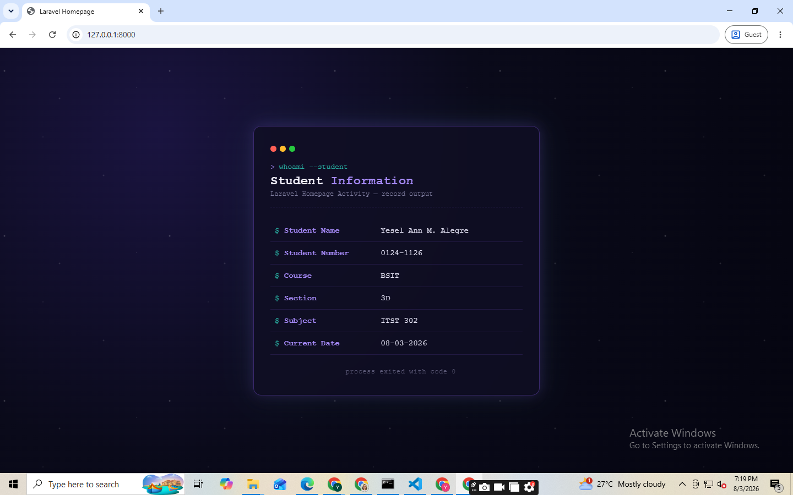</p>

> 📌 *Customized Laravel homepage displaying student information (Name, Student Number, Course, Section, Subject, and Current Date).*

---

### Part 10 — Push Project to GitHub
Pushed the completed project to a GitHub repository named `client-server-week02-laravel-setup`, including the Laravel project files, `README.md`, and the `screenshots/` folder.

<br>

---

## 🗂️ Project Structure

| Folder | Purpose |
|:---|:---|
| `app/` | Contains the core application logic, including Models, Controllers, and Providers that handle the app's business logic and data flow. |
| `routes/` | Defines all the application's routes (URLs) and maps them to the appropriate controllers or closures — e.g., `web.php` for browser-based routes. |
| `resources/` | Holds views (Blade templates), raw CSS/JS assets, and language files used to build the front-end and UI of the application. |
| `public/` | The web server's document root; contains the entry point `index.php`, along with compiled/public assets like images, CSS, and JS. |
| `config/` | Stores all configuration files for the application, such as database, mail, session, and cache settings. |
| `database/` | Contains database migrations, seeders, and factories used to define and populate the database schema. |

<br>

---

## 🐛 Problems Encountered

| # | Problem |
|:---:|:---|
| 1 | **Missing `.env` file and application key** — Laravel could not run properly because the `.env` file and application encryption key were not yet generated. |
| 2 | **Missing SQLite database file** — The project was initially configured to use SQLite, but the `database.sqlite` file did not exist, causing database-related errors. |
| 3 | **`php artisan serve` run in the wrong directory** — Running the command outside the project folder resulted in a `Could not open input file: artisan` error, along with duplicate Laravel files being accidentally created outside the actual project folder. |
| 4 | **PHP module warnings** — PHP displayed warnings about missing `pdo_firebird` and SNMP modules when running certain commands. Non-blocking, but still needed to be addressed for a cleaner setup. |
| 5 | **Configuration/cache conflicts** — After updating `.env` settings (such as switching session, cache, and queue drivers), Laravel kept using old cached configuration values. |

<br>

---

## 🔧 Solutions

| Problem | Solution |
|:---|:---|
| Missing `.env` / app key | Copied `.env.example` to `.env`, then ran `php artisan key:generate`. |
| Missing SQLite file | Manually created the `database.sqlite` file inside the `database/` folder. |
| Wrong directory error | Navigated to the correct project folder (containing `artisan`) and deleted the duplicate files. |
| Missing PHP modules | Confirmed the warnings were non-blocking and unrelated to project requirements. |
| Cached config conflicts | Ran `php artisan config:clear` and `php artisan cache:clear` after every `.env` update. |

> 💡 These issues were resolved through a combination of AI assistance, trial and error, and guidance from our professor.

<br>

---

## 💭 Reflection

Working on this activity gave me a much deeper understanding of what it actually takes to set up a Laravel development environment from scratch. Before this, I only knew Laravel as "a PHP framework," but going through the process of installing PHP, Composer, Git, MySQL, and the Laravel Installer myself — and troubleshooting each error along the way — helped me understand how all these tools work together to support a single application.

One of the biggest challenges I encountered was dealing with configuration errors, like the missing `.env` file, missing application key, and missing SQLite database file. At first, these errors were confusing because the messages did not clearly explain what was missing. I also ran into a directory issue where I tried running `php artisan serve` from the wrong folder, which led me to accidentally create duplicate project files. These mistakes taught me the importance of double-checking my working directory and reading terminal error messages carefully instead of assuming the problem is something more complicated than it actually is.

Laravel is important in client-server development because it simplifies many of the repetitive and complex tasks involved in building web applications — such as routing, database interaction, authentication, and templating. Instead of manually writing raw PHP code to handle HTTP requests and responses, Laravel provides a structured, secure, and organized way to build the server-side of an application, while still working seamlessly with client-side technologies like HTML, CSS, and JavaScript. This structure makes it easier for developers to build applications that are scalable, maintainable, and easier to debug.

This activity will help me in future software development projects because it gave me hands-on experience with the entire environment setup process, not just the coding itself. Knowing how to properly install and configure a development environment, troubleshoot common setup errors, and organize a Laravel project is a foundational skill that I will carry into future projects — whether in school or in a professional internship setting. Since my career goal is front-end web and mobile application development with an interest in UI/UX design, understanding how the back-end (server) side works through Laravel also gives me a more complete picture of how full-stack applications function, which will make me a more well-rounded developer moving forward.

<br>

---

## 📚 References

Fenstermacher, K., & Otwell, T. (2024). *Laravel documentation*. Laravel. https://laravel.com/docs

Getcomposer.org. (2024). *Composer documentation*. Composer. https://getcomposer.org/doc/

Git. (2024). *Git documentation*. Git. https://git-scm.com/doc

The PHP Group. (2024). *PHP: Documentation*. PHP. https://www.php.net/docs.php

<br>

<div align="center">

**Yesel Ann M. Alegre** · BSIT 3D · ITST 302

</div>